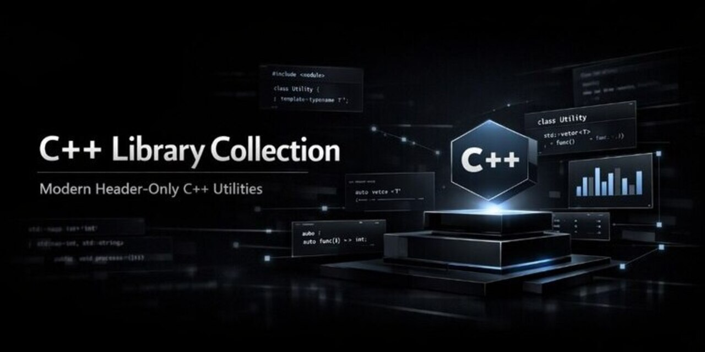

# 📚 C++ Library Collection

<div align="center">



</div>

<div align="center">

<b>A collection of reusable modern C++ header-only libraries for everyday programming tasks.</b>

</div>

<div align="center">


</div>

---

## 📖 Overview

**C++ Library Collection** is a lightweight collection of reusable **header-only C++17 libraries** designed to simplify common programming tasks.

The project provides clean, reusable, and easy-to-integrate utilities for:

- String manipulation
- Date operations
- Date range handling
- Input validation
- General-purpose helper functions

The entire project is **self-contained**, requires **no external dependencies**, and is designed with clean code principles and reusable software design in mind.

---

## 📚 Table of Contents

- [Overview](#-overview)
- [Features](#-features)
- [Included Libraries](#-included-libraries)
- [Project Structure](#-project-structure)
- [Installation](#-installation)
- [Getting Started](#-getting-started)
- [Example](#-example)
- [Requirements](#-requirements)
- [Documentation](#-documentation)
- [Roadmap](#-roadmap)
- [Contributing](#-contributing)
- [License](#-license)

---

## ✨ Features

- 🚀 Header-only architecture
- ⚡ Easy integration
- 📦 No external dependencies
- 🧩 Reusable utility classes
- 🛠 Built with modern C++17
- 💻 Ready-to-use examples
- 📚 Clean and intuitive API
- 🔄 Designed for future expansion

---

## 📦 Included Libraries

| Library | Description |
|---------|-------------|
| **String** | Comprehensive string utilities including trimming, splitting, joining, text formatting, case conversion, word and letter analysis, word replacement, word reversal, and punctuation removal. |
| **Date** | Comprehensive date and calendar utilities including validation, parsing, formatting, comparisons, date arithmetic, calendars, business days, vacation calculations, and date difference operations. |
| **Period** | Represents date ranges and provides utilities for automatic range normalization and period overlap detection. |
| **InputValidate** | Input validation utilities including safe numeric input, range validation, and date validation. |
| **Util** | General-purpose helper utilities including random number and text generation, key generation, array initialization, array shuffling, swapping, text encryption/decryption, and formatting helpers. |

---

## 📁 Project Structure

```text
Cpp-Library-Collection
│
├── Lib/
│   ├── Date.h
│   ├── InputValidate.h
│   ├── Period.h
│   ├── String.h
│   └── Util.h
│
├── Examples/
│   └── main.cpp
│
├── assets/
│   └── banner.png
│
├── README.md
├── CHANGELOG.md
├── LICENSE
└── .gitignore
```

---

## 📥 Installation

Clone the repository:

```bash
git clone https://github.com/<yusuf-alshalabi>/Cpp-Library-Collection.git
```

Since the project is **header-only**, no installation or build step is required.

Simply include the headers you need in your project.

---

## 🚀 Getting Started

```cpp
#include "Lib/String.h"
#include "Lib/Date.h"
#include "Lib/Period.h"
#include "Lib/InputValidate.h"
#include "Lib/Util.h"
```

That's it — no additional compilation, linking, or external libraries are required.

---

## 💻 Example

```cpp
#include <iostream>
#include "Lib/String.h"

int main()
{
    String text("   hello world   ");

    text.Trim();
    text.UpperFirstLetterOfEachWord();

    std::cout << text.Value << std::endl;
}
```

Additional examples can be found in the **Examples** directory.

---

## 📋 Requirements

- C++17 or newer
- Any modern C++ compiler
- No external dependencies

---

## 📚 Documentation

| Document | Description |
|----------|-------------|
| 📜 [CHANGELOG.md](CHANGELOG.md) | Complete version history and release notes. |
| 📄 [LICENSE](LICENSE) | MIT License. |

---

## 🗺 Roadmap

### ✅ Version 1.0.0

- Header-only architecture
- String library
- Date library
- Period library
- InputValidate library
- Util library

### 🚧 Version 1.1.0

- Full Doxygen API documentation
- Expand existing libraries
- Additional usage examples
- Performance improvements
- Better cross-platform compatibility

---

## 🤝 Contributing

Contributions, suggestions, bug reports, and pull requests are always welcome.

If you have ideas for improving the project, feel free to open an issue or submit a pull request.

---

## 📄 License

This project is licensed under the **MIT License**.

See the [LICENSE](LICENSE) file for more information.

---

<div align="center">

Made with ❤️ by <b>Yusuf Zakaria Alshalabi</b>

⭐ If you find this project useful, consider giving it a star.

</div>